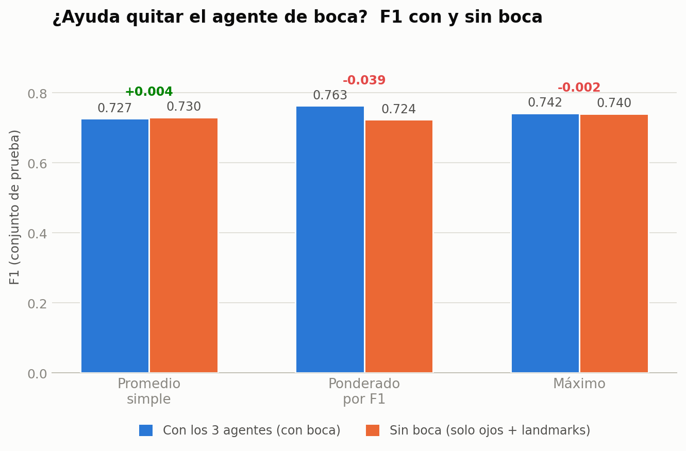

# Agente integrador — informe de resultados

El integrador combina tres señales de somnolencia (**cierre ocular**, **apertura bucal**, **probabilidad de landmarks**) con una **regla fija, sin entrenar ningún modelo** — fusión a nivel de decisión (Kittler et al., 1998). Se evaluó sobre las mismas 4 personas de validación y 4 de prueba que usa el resto del proyecto (1.499 imágenes de prueba). El umbral (o los pesos, cuando aplica) siempre se elige en validación y se aplica sin tocar en prueba.

## 1. Cada señal por separado

| Señal | AUC prueba | F1 | Recall dormido |
|---|---|---|---|
| **Landmarks** (EAR, MAR, geometría facial) | **0,791** | **0,740** | 0,981 |
| **Ojos** (cierre ocular, VGG19+Attention) | 0,784 | 0,728 | 0,822 |
| Boca (apertura, ViT-B/16) | 0,416 | 0,357 | 0,246 |

Landmarks y ojos son señales fuertes y comparables. **Boca sale con AUC por debajo de 0,5**: en esta muestra, boca más abierta se asocia más con *despierto* que con *dormido* (el bostezo es raro — ~4,5% del dataset — así que "apertura de boca" en una foto probablemente captura habla, no somnolencia).

## 2. Reglas de fusión, explicadas

| # | Regla | Cómo funciona |
|---|---|---|
| 1 | Voto mayoritario | Cada agente vota "dormido" si su score ≥ 0,5; se alerta si **≥2 de 3** votan dormido. |
| 2 | Promedio simple | Se promedian las tres señales por igual (⅓ cada una). |
| 3 | Ponderado por F1 | Cada señal pesa según **qué tan bien le fue sola** en validación: `peso = F1ᵢ / ΣF1`. |
| 4 / 4b | Barrido de pesos | Se prueban ~230 combinaciones de pesos y se elige la mejor en validación (por AUC / por F1). |
| 5 | Máximo | Se alerta si **cualquiera** de los tres agentes está muy seguro. Maximiza recall. |

## 3. Resultado de cada regla (prueba)

| Regla | Accuracy | Precisión | Recall dormido | **F1** |
|---|---|---|---|---|
| 1. Voto mayoritario | 0,544 | 0,737 | 0,135 | 0,228 |
| 2. Promedio simple | 0,625 | 0,571 | 1,000 | 0,727 |
| **3. Ponderado por F1** | **0,693** | 0,621 | 0,989 | **0,763** |
| 4. Barrido (por AUC) | 0,672 | 0,615 | 0,916 | 0,736 |
| 4b. Barrido (por F1) | 0,700 | 0,659 | 0,829 | 0,734 |
| 5. Máximo | 0,658 | 0,595 | 0,985 | 0,742 |

**Gana la regla 3** (pesos: ojos 0,51 · boca 0,04 · landmarks 0,45), y es la única que supera a los dos mejores agentes por separado (F1=0,763 vs. 0,740 de landmarks solo). El **voto mayoritario es, por lejos, la peor regla** (F1=0,228): con boca votando mal, exigir 2 votos de 3 es demasiado estricto. El **barrido de pesos generaliza peor que la fórmula simple de la regla 3**, a pesar de buscar explícitamente la mejor combinación — con solo 4 personas de validación, ~230 combinaciones encuentran fácilmente algo que luce bien por puro ruido y no generaliza. Es el mismo argumento de Kittler et al.: entre reglas no entrenadas, la más simple suele ganarle a la que más "busca".

## 4. La pregunta que surgió: si boca sale tan mal, ¿no deberíamos quitarla?

Boca tiene AUC por debajo de azar — la hipótesis natural era que sacarla del integrador solo podía ayudar. Se probó recalculando las 3 reglas de promedio usando **solo ojos + landmarks**.

| Regla | F1 con boca | F1 sin boca | Diferencia |
|---|---|---|---|
| Promedio simple | 0,727 | 0,730 | +0,004 (igual) |
| **Ponderado por F1 (la ganadora)** | **0,763** | 0,724 | **−0,039 (empeora)** |
| Máximo | 0,742 | 0,740 | −0,002 (igual) |

**El resultado fue el contrario al esperado: quitar boca no ayuda, y en la regla ganadora empeora.** La explicación más plausible: aunque boca es una señal débil por sí sola, su pequeño peso (4%) aporta *diversidad* al promedio — sus errores no van en la misma dirección que los de ojos/landmarks —, en vez de solo sumar ruido. Es el mismo principio detrás de por qué, en un ensamble, una señal individualmente floja puede seguir sumando valor si se equivoca distinto que el resto.

## 5. Conclusión y recomendación

1. **Usar la regla 3 (promedio ponderado por F1)** como integrador final — pesos {ojos: 0,51, boca: 0,04, landmarks: 0,45}. Es la única regla que mejora sobre ambos agentes fuertes por separado.
2. **No eliminar el agente de boca.** Su desempeño individual es malo, pero la evidencia muestra que sacarlo del integrador no mejora nada y en el mejor caso empeora — la fusión ya lo neutraliza asignándole poco peso, que es la forma correcta de tratar una señal débil.
3. **Reportar el promedio simple como línea base teórica** y el voto mayoritario como línea base ingenua, para que la elección final quede respaldada por comparación, no por decisión arbitraria.

*Con solo 4 personas en validación y 4 en prueba, diferencias de pocas centésimas en F1 deben leerse con cautela — no son una ley general, sino la mejor evidencia disponible con esta muestra.*

---
*Referencia teórica: Kittler, J., Hatef, M., Duin, R. P. W., & Matas, J. (1998). On combining classifiers. IEEE TPAMI, 20(3), 226–239. Detalle metodológico completo (bugs encontrados, pipeline de extracción, limitaciones) en `INFORME_INTEGRADOR.md`.*
