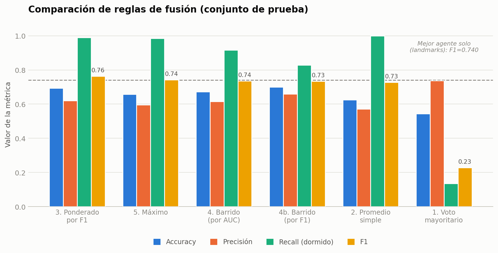

# Resultados del agente integrador

El integrador combina tres señales de somnolencia (cierre ocular, apertura bucal, probabilidad de landmarks) con una **regla fija, sin entrenar ningún modelo** — un enfoque conocido como *fusión a nivel de decisión* (Kittler et al., 1998). Se evaluó sobre el mismo conjunto de prueba usado por el resto del proyecto (4 personas, 1.499 imágenes), aplicando siempre el umbral elegido en validación.

## 1. Cada señal por separado

| Señal | AUC prueba | F1 | Recall dormido |
|---|---|---|---|
| **Landmarks** (EAR, MAR, geometría facial) | **0,791** | **0,740** | 0,981 |
| **Ojos** (cierre ocular, VGG19+Attention) | 0,784 | 0,728 | 0,822 |
| Boca (apertura, ViT-B/16) | 0,416 | 0,357 | 0,246 |

Landmarks y ojos son señales fuertes y comparables entre sí. **Boca sale con AUC por debajo de 0,5**: en esta muestra, una boca más abierta se asocia más con estar despierto que dormido (el bostezo es un evento raro — ~4,5% del dataset —, así que probablemente esta señal captura habla u otro gesto, no somnolencia).

## 2. Las reglas de fusión, explicadas

Cada regla combina las tres señales de una forma distinta. Todas parten de tratar cada señal como un número entre 0 y 1 ("qué tan somnoliento parece" según ese agente):

| # | Regla | Cómo funciona |
|---|---|---|
| 1 | **Voto mayoritario** | Cada agente vota "dormido" si su score ≥ 0,5. Se alerta solo si **al menos 2 de los 3** votan dormido. |
| 2 | **Promedio simple** | Se promedian las tres señales por igual (⅓ cada una) y se compara contra un umbral. |
| 3 | **Promedio ponderado por F1** | Igual que el promedio, pero cada señal pesa según **qué tan bien le fue sola** en validación: `peso = F1 de esa señal / suma de los tres F1`. Al agente que más acierta se le hace más caso. |
| 4 | **Barrido de pesos** | En vez de calcular los pesos con una fórmula, se **prueban ~230 combinaciones posibles** de pesos y se elige la que mejor funciona en validación (por AUC, o por F1 en la variante 4b). |
| 5 | **Máximo** | Se alerta si **cualquiera** de los tres agentes está muy seguro, aunque los otros dos no. Pensada para maximizar el recall (nunca dejar pasar una alerta real). |

## 3. Resultados de cada regla (prueba)

| Regla | Accuracy | Precisión | **Recall dormido** | **F1** |
|---|---|---|---|---|
| 1. Voto mayoritario | 0,544 | 0,737 | 0,135 | 0,228 |
| 2. Promedio simple | 0,625 | 0,571 | 1,000 | 0,727 |
| **3. Ponderado por F1** | **0,693** | 0,621 | 0,989 | **0,763** |
| 4. Barrido de pesos (por AUC) | 0,672 | 0,615 | 0,916 | 0,736 |
| 4b. Barrido de pesos (por F1) | 0,700 | 0,659 | 0,829 | 0,734 |
| 5. Máximo | 0,658 | 0,595 | 0,985 | 0,742 |

**Pesos de la regla 3 (la ganadora):** ojos 0,51 · boca 0,04 · landmarks 0,45. Boca casi no pesa nada — consistente con que es la señal que peor le fue sola.

*Reglas ordenadas por F1 (de mayor a menor). La línea punteada marca el F1 del mejor agente individual (landmarks solo, 0,740): solo la regla 3 la supera.*

## 4. Conclusión

- **La regla 3 (promedio ponderado por F1) gana**, y es la única que supera a los dos mejores agentes por separado (0,763 vs. 0,740 de landmarks solo y 0,728 de ojos solo). Cuando dos señales son buenas e independientes entre sí (una viene de píxeles, la otra de geometría), combinarlas con un peso proporcional a su desempeño individual sí aporta.
- **El voto mayoritario es la peor regla por lejos** (F1 = 0,228): con una de las tres señales (boca) mal, exigir 2 votos de 3 es demasiado estricto.
- **El barrido de pesos, a pesar de "buscar" la mejor combinación, generaliza peor que la fórmula simple de la regla 3.** Con solo 4 personas de validación, una búsqueda de ~230 combinaciones encuentra fácilmente un resultado que luce bien por casualidad mas no en prueba. La regla 3 no busca nada — solo usa una fórmula fija — y por eso es más robusta. Este es el mismo principio que defienden Kittler et al. (1998): entre reglas de combinación no entrenadas, la más simple suele generalizar mejor.

**Recomendación:** usar la regla 3 como integrador final, reportando el promedio simple (regla 2) como línea base teórica de referencia.
